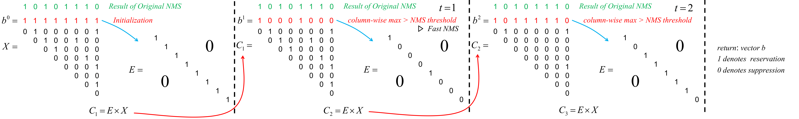

### [English](README.md) | 简体中文

## Complete-IoU Loss and Cluster-NMS for Improving Object Detection and Instance Segmentation. 

我们的论文已收录于**IEEE Transactions on Cybernetics (TCYB)**.

### 本代码基于YOLACT++.

这是我们论文的代码实现:
 - [Distance-IoU Loss: Faster and Better Learning for Bounding Box Regression](https://arxiv.org/abs/1911.08287)
 - [Enhancing Geometric Factors into Model Learning and Inference for Object Detection and Instance Segmentation](https://arxiv.org/abs/2005.03572)

```
@Inproceedings{zheng2020diou,
  author    = {Zheng, Zhaohui and Wang, Ping and Liu, Wei and Li, Jinze and Ye, Rongguang and Ren, Dongwei},
  title     = {Distance-IoU Loss: Faster and Better Learning for Bounding Box Regression},
  booktitle = {The AAAI Conference on Artificial Intelligence (AAAI)},
  year      = {2020},
}

@Article{zheng2021ciou,
  author    = {Zheng, Zhaohui and Wang, Ping and Ren, Dongwei and Liu, Wei and Ye, Rongguang and Hu, Qinghua and Zuo, Wangmeng},
  title     = {Enhancing Geometric Factors in Model Learning and Inference for Object Detection and Instance Segmentation},
  booktitle = {IEEE Transactions on Cybernetics},
  year      = {2021},
}
```

## Cluster-NMS的描述与使用

下面是Cluster-NMS算法的示意图，其中 X 表示IoU矩阵，它是由`X=jaccard(boxes,boxes).triu_(diagonal=1) > nms_thresh`计算得到的，当然`boxes`会事先用分类score降序排列。




NMS的输入是形状为[n,4]的`boxes`，以及形状为[80,n]的分类`scores`。(以coco为例)

NMS有两种途径，各有各的特点。

第一种是所有类别具有相同数量的框。首先，我们对每个类依照`scores`选取top k=200个框。于是`boxes`的形状变为[80,200,4]。执行Cluster-NMS主体程序并最后保留`scores>0.01`的框。最终返回前100个高分的框。

第二种是不同的类别具有不同数量的框。首先，我们一开始就用`scores`阈值(比如0.01)过滤掉了大多数的低分检测框。这一步导致了不同的类别可能剩下了不同数量的框。并且注意到同一个框可能出现很多次，因为其可能有多个类别的`score`都大于了0.01这个阈值。接着把所有的框放到一起并按照`score`降序排列。
接着我们给boxes添加偏移量，使用`torch.arange(0,80)`。这将导致不同类别的框不再相交，它们的IoU一定为0。这是因为(x1,y1,x2,y2)的坐标都在(0,1)区间内，因此我给每个框的坐标都加上它的类标签，就可以强行让不同类别的框分到不同的cluster中。例如某个框属于第61类，其坐标本来都介于(0,1)之间，加上了类标签偏移量后，它的坐标都将介于(60,61)这个区间。
最后执行Cluster-NMS主体程序，并返回前100个框。对于这种途径的Cluster-NMS方法，可参阅我们的另一代码库[SSD](https://github.com/Zzh-tju/DIoU-SSD-pytorch/blob/master/utils/detection/detection.py)

## 指南

### 1) CIoU 与 Cluster-NMS

1. YOLACT (See [YOLACT](https://github.com/Zzh-tju/CIoU#YOLACT))

2. YOLOv3-pytorch [https://github.com/Zzh-tju/ultralytics-YOLOv3-Cluster-NMS](https://github.com/Zzh-tju/ultralytics-YOLOv3-Cluster-NMS)

3. YOLOv5 (支持批处理模式的Cluster-NMS。当使用测试阶段增强时，如多尺度测试，将大大加速NMS。) [https://github.com/Zzh-tju/yolov5](https://github.com/Zzh-tju/yolov5)

4. SSD-pytorch [https://github.com/Zzh-tju/DIoU-SSD-pytorch](https://github.com/Zzh-tju/DIoU-SSD-pytorch)

### 2) DIoU 与 CIoU 纳入检测器

1. YOLO v3 [https://github.com/Zzh-tju/DIoU-darknet](https://github.com/Zzh-tju/DIoU-darknet)

2. SSD [https://github.com/Zzh-tju/DIoU-SSD-pytorch](https://github.com/Zzh-tju/DIoU-SSD-pytorch)

3. Faster R-CNN [https://github.com/Zzh-tju/DIoU-pytorch-detectron](https://github.com/Zzh-tju/DIoU-pytorch-detectron)

4. 模拟实验 [https://github.com/Zzh-tju/DIoU](https://github.com/Zzh-tju/DIoU)

# YOLACT

### 代码位置与可选项

参见[layers/modules/multibox_loss.py](layers/modules/multibox_loss.py)中的`ciou` function，这是我们PyTorch实现的CIoU loss.

目前NMS支持两种模式：(见[eval.py](eval.py))

1. Cross-class模式，它将忽略类别，也就是所有类别混在一起处理。`cross_class_nms=True`，这将比per-class模式快一点，但性能会略微下降。

2. per-class模式，不同的类别分别NMS。(`cross_class_nms=False`)

目前，NMS支持这几种设置：`fast_nms`, `cluster_nms`, `cluster_diounms`, `spm`, `spm_dist`, `spm_dist_weighted`。

见[layers/functions/detection.py](layers/functions/detection.py)，这是我们Cluster-NMS的PyTorch实现.

# 安装

要想使用YOLACT++, 确保你编译了DCNv2的代码.

 - 下载本代码，并进入:
   ```Shell
   git clone https://github.com/Zzh-tju/CIoU.git
   cd yolact
   ```
 - 使用以下的其中一个方法安装环境:
   - 使用[Anaconda](https://www.anaconda.com/distribution/)
     - 运行`conda env create -f environment.yml`
   - 使用pip
     - 创建Python3环境(例如使用virtenv).
     - 安装[Pytorch](http://pytorch.org/) 1.0.1 (或更高版本)与TorchVision.
     - 安装一些其它的包:
       ```Shell
       # Cython需要在pycocotools之前安装
       pip install cython
       pip install opencv-python pillow pycocotools matplotlib 
       ```
 - 如要训练YOLACT, 下载COCO 2017数据集. 请注意，此脚本将花费一些时间，并将21G的文件转储到`./data/coco`.
   ```Shell
   sh data/scripts/COCO.sh
   ```
 - 如想在COCO `test-dev`上测试YOLACT, 需下载`test-dev`：
   ```Shell
   sh data/scripts/COCO_test.sh
   ```
 - 如需使用YOLACT++, 编译DCN layer ([DCNv2](https://github.com/CharlesShang/DCNv2/tree/pytorch_1.0)).
   ```Shell
   cd external/DCNv2
   python setup.py build develop
   ```

# 评估
以下是我们训练的YOLACT模型 (2020.5.5发布) 以及测试速度FPS，在单张GTX 1080 Ti上评估，所用测试集为`coco 2017 val`:

训练在双GPU上进行，使用如下命令：
`
python train.py --config=yolact_base_config --batch_size=8
`

| Image Size | Backbone  | Loss  | NMS  | FPS  | box AP  | mask AP  | Weights   |                                                       
|:----:|:-------------:|:-------:|:----:|:----:|:----:|:----:|----------------------------------------------------------------------------------------------------------------------|
| 550  | Resnet101-FPN | SL1  | Fast NMS | 30.6 | 31.5 | 29.1 |[SL1.pth](https://share.weiyun.com/5N840Hm)  | 
| 550  | Resnet101-FPN | CIoU | Fast NMS | 30.6 | 32.1 | 29.6 | [CIoU.pth](https://share.weiyun.com/5EtJ4dJ) | 

如要测试模型，请将权重放置在`./weights`目录下，并运行以下其中一个命令。

## COCO结果
```
# 在整个测试集上评估模型，这将输出一个COCOEval json文件，你可用于提交至COCO服务器(对于test-dev)或用run_coco_eval.py脚本直接评估(对于val 2017)。

# 以下命令将创建'./results/bbox_detections.json' 与 './results/mask_detections.json' ，分别对应目标检测与实例分割。
python eval.py --trained_model=weights/yolact_base_54_800000.pth --output_coco_json

# 运行以下命令来评估刚刚生成的json文件。
python run_coco_eval.py

# 如想生成一个test-dev的COCO json文件，请确保你下载了test-dev数据集，然后运行
python eval.py --trained_model=weights/yolact_base_54_800000.pth --output_coco_json --dataset=coco2017_testdev_dataset
```
## COCO检测结果可视化
```
# 一般会使用0.15的分类score阈值。
python eval.py --trained_model=weights/yolact_base_54_800000.pth --score_threshold=0.15 --top_k=15 --display
```
## Cluster-NMS 速度评估
```
python eval.py --trained_model=weights/yolact_base_54_800000.pth --benchmark
```
#### 设备
 - 1 GTX 1080 Ti
 - Intel(R) Core(TM) i7-6850K CPU @ 3.60GHz

| Image Size | Backbone  | Loss  | NMS  | FPS  | box AP | box AP75 | box AR100 | mask AP | mask AP75 | mask AR100 |
|:----:|:-------------:|:-------:|:------------------------------------:|:----:|:----:|:----:|:----:|:----:|:----:|:----:|
| 550  | Resnet101-FPN | CIoU  |                 Fast NMS               |**30.6**|  32.1  |  33.9  |  43.0  |  29.6  |  30.9  |  40.3  |
| 550  | Resnet101-FPN | CIoU  |               Original NMS             |  11.5  |  32.5  |  34.1  |  45.1  |  29.7  |  31.0  |  41.7  |
| 550  | Resnet101-FPN | CIoU  |               Cluster-NMS              |  28.8  |  32.5  |  34.1  |  45.2  |  29.7  |  31.0  |  41.7  |
| 550  | Resnet101-FPN | CIoU  |             SPM Cluster-NMS            |  28.6  |  33.1  |  35.2  |  48.8  |**30.3**|**31.7**|  43.6  |
| 550  | Resnet101-FPN | CIoU  |       SPM + Distance Cluster-NMS       |  27.1  |  33.2  |  35.2  |**49.2**|  30.2  |**31.7**|**43.8**|
| 550  | Resnet101-FPN | CIoU  | SPM + Distance + Weighted Cluster-NMS  |  26.5  |**33.4**|**35.5**|  49.1  |**30.3**|  31.6  |**43.8**|

以下是使用YOLACT官方的预训练权重评估。([yolact_resnet50_54_800000.pth](https://ucdavis365-my.sharepoint.com/:u:/g/personal/yongjaelee_ucdavis_edu/EUVpxoSXaqNIlssoLKOEoCcB1m0RpzGq_Khp5n1VX3zcUw))

| Image Size | Backbone  | Loss  | NMS  | FPS  | box AP | box AP75 | box AR100 | mask AP | mask AP75 | mask AR100 |
|:----:|:-------------:|:-------:|:-----------------------------------:|:----:|:----:|:----:|:----:|:----:|:----:|:----:|
| 550  | Resnet50-FPN | SL1  |                 Fast NMS               |**41.6**|  30.2  |  31.9  |  42.0  |  28.0  |  29.1  |  39.4  |
| 550  | Resnet50-FPN | SL1  |               Original NMS             |  12.8  |  30.7  |  32.0  |  44.1  |  28.1  |  29.2  |  40.7  |
| 550  | Resnet50-FPN | SL1  |               Cluster-NMS              |  38.2  |  30.7  |  32.0  |  44.1  |  28.1  |  29.2  |  40.7  |
| 550  | Resnet50-FPN | SL1  |             SPM Cluster-NMS            |  37.7  |  31.3  |  33.2  |  48.0  |**28.8**|**29.9**|  42.8  |
| 550  | Resnet50-FPN | SL1  |       SPM + Distance Cluster-NMS       |  35.2  |  31.3  |  33.3  |  48.2  |  28.7  |**29.9**|  42.9  |
| 550  | Resnet50-FPN | SL1  | SPM + Distance + Weighted Cluster-NMS  |  34.2  |**31.8**|**33.9**|**48.3**|**28.8**|**29.9**|**43.0**|

以下是使用YOLACT官方的预训练权重评估。([yolact_base_54_800000.pth](https://drive.google.com/file/d/1UYy3dMapbH1BnmtZU4WH1zbYgOzzHHf_/view?usp=sharing))

| Image Size | Backbone  | Loss  | NMS  | FPS  | box AP | box AP75 | box AR100 | mask AP | mask AP75 | mask AR100 |
|:----:|:-------------:|:-------:|:-----------------------------------:|:----:|:----:|:----:|:----:|:----:|:----:|:----:|
| 550  | Resnet101-FPN | SL1  |                 Fast NMS               |**30.6**|  32.5  |  34.6  |  43.9  |  29.8  |  31.3  |  40.8  |
| 550  | Resnet101-FPN | SL1  |               Original NMS             |  11.9  |  32.9  |  34.8  |  45.8  |  29.9  |  31.4  |  42.1  |
| 550  | Resnet101-FPN | SL1  |               Cluster-NMS              |  29.2  |  32.9  |  34.8  |  45.9  |  29.9  |  31.4  |  42.1  |
| 550  | Resnet101-FPN | SL1  |             SPM Cluster-NMS            |  28.8  |  33.5  |  35.9  |  49.7  |**30.5**|**32.1**|  44.1  |
| 550  | Resnet101-FPN | SL1  |       SPM + Distance Cluster-NMS       |  27.5  |  33.5  |  35.9  |**50.2**|  30.4  |  32.0  |**44.3**|
| 550  | Resnet101-FPN | SL1  | SPM + Distance + Weighted Cluster-NMS  |  26.7  |**34.0**|**36.6**|  49.9  |**30.5**|  32.0  |**44.3**|

以下是YOLACT++，同样是官方的预训练权重评估。([yolact_plus_base_54_800000.pth](https://ucdavis365-my.sharepoint.com/:u:/g/personal/yongjaelee_ucdavis_edu/EVQ62sF0SrJPrl_68onyHF8BpG7c05A8PavV4a849sZgEA))

| Image Size | Backbone  | Loss  | NMS  | FPS  | box AP | box AP75 | box AR100 | mask AP | mask AP75 | mask AR100 |
|:----:|:-------------:|:-------:|:-----------------------------------:|:----:|:----:|:----:|:----:|:----:|:----:|:----:|
| 550  | Resnet101-FPN | SL1  |                 Fast NMS               |**25.1**|  35.8  |  38.7  |  45.5  |  34.4  |  36.8  |  42.6  |
| 550  | Resnet101-FPN | SL1  |               Original NMS             |  10.9  |  36.4  |  39.1  |  48.0  |  34.7  |  37.1  |  44.1  |
| 550  | Resnet101-FPN | SL1  |               Cluster-NMS              |  23.7  |  36.4  |  39.1  |  48.0  |  34.7  |  37.1  |  44.1  |
| 550  | Resnet101-FPN | SL1  |             SPM Cluster-NMS            |  23.2  |  36.9  |  40.1  |  52.8  |**35.0**|  37.5  |**46.3**|
| 550  | Resnet101-FPN | SL1  |       SPM + Distance Cluster-NMS       |  22.0  |  36.9  |  40.2  |**53.0**|  34.9  |  37.5  |**46.3**|
| 550  | Resnet101-FPN | SL1  | SPM + Distance + Weighted Cluster-NMS  |  21.7  |**37.4**|**40.6**|  52.5  |**35.0**|**37.6**|**46.3**|
#### 注:
 - 我们还测试了SPM + Distance + Weighted Cluster-NMS策略，其中坐标加权仅针对`IoU> 0.8`的框，我们发现`IoU>0.5`对于YOLACT来说不够好，而`IoU>0.9`又几乎与`SPM + Distance Cluster-NMS`相当. (参见[CAD](https://ieeexplore.ieee.org/stamp/stamp.jsp?tp=&arnumber=8265304)了解更多Weighted-NMS的细节。)

 - YOLACT官方提供的Original NMS要比本代码的快，因为其预先使用了分类score阈值 (0.05)来过滤了大量的框，以YOLACT ResNet101-FPN为例，约22 ~ 23 FPS，但性能会有下降，为了确保相同的性能，我们不使用该预先分类score阈值。
 
 - 注意到Torchvision NMS拥有最快的速度，这是由于CUDA编写与工程化加速(如只计算上三角IoU矩阵)。而我们的Cluster-NMS只需更少的迭代，并也可以进一步工程化加速。

 - 目前Torchvision NMS使用IoU为评价准则，而不是DIoU。然而，如果我们直接在Original NMS中替换IoU为DIoU，得到DIoU-NMS，这将导致更大的计算开销。现在，Cluster-DIoU-NMS将大大加速DIoU-NMS，并保持与DIoU-NMS一样的精度。

 - Torchvision NMS是Torchvision>=0.3中的函数，而我们的Cluster-NMS可以应用于任何低版本Torchvision的代码库或其他的深度学习框架，只要其可以进行矩阵运算。**无需其他import，无需编译，更少的迭代，完全GPU加速，以及更好的性能**。

## 可视化
```Shell
# 如下命令检测特定的图片。
python eval.py --trained_model=weights/yolact_base_54_800000.pth --score_threshold=0.15 --top_k=15 --image=my_image.png

# 检测特定的图片并保存。
python eval.py --trained_model=weights/yolact_base_54_800000.pth --score_threshold=0.15 --top_k=15 --image=input_image.png:output_image.png

# 检测一个目录中的所有图片。
python eval.py --trained_model=weights/yolact_base_54_800000.pth --score_threshold=0.15 --top_k=15 --images=path/to/input/folder:path/to/output/folder
```
## 视频检测
```Shell
# 实时检测视频流，"--video_multiframe" 将一次性检测多帧以提高性能。
# 使用"--display_fps"将打印FPS在每一帧上。
python eval.py --trained_model=weights/yolact_base_54_800000.pth --score_threshold=0.15 --top_k=15 --video_multiframe=4 --video=my_video.mp4

# 实时显示网络摄像头。如果你有多个网络摄像头，请传递所需网络摄像头的索引，而不是0。
python eval.py --trained_model=weights/yolact_base_54_800000.pth --score_threshold=0.15 --top_k=15 --video_multiframe=4 --video=0

# 处理视频并保存。
python eval.py --trained_model=weights/yolact_base_54_800000.pth --score_threshold=0.15 --top_k=15 --video_multiframe=4 --video=input_video.mp4:output_video.mp4
```
正如你看到的，`eval.py`能做很多事情，添加`--help`命令查看它所能做的一切。
```Shell
python eval.py --help
```
# 训练
默认训练COCO。
 - 准备ImageNet预训练模型并将其放置于`./weights`目录。
   - [resnet101_reducedfc.pth](https://drive.google.com/file/d/1tvqFPd4bJtakOlmn-uIA492g2qurRChj/view?usp=sharing).
   - [resnet50-19c8e357.pth](https://drive.google.com/file/d/1Jy3yCdbatgXa5YYIdTCRrSV0S9V5g1rn/view?usp=sharing).
   - [darknet53.pth](https://drive.google.com/file/d/17Y431j4sagFpSReuPNoFcj9h7azDTZFf/view?usp=sharing).
 - 运行以下其中一个训练命令。
   - 训练过程中如按下ctrl+c将保存一个中断的权重`*_interrupt.pth`。
   - 所有权重将保存于`./weights`，文件名为`<config>_<epoch>_<iter>.pth`.
```Shell
# 默认batch size 8的训练，使用base config。
python train.py --config=yolact_base_config

# 训练yolact_base_config， batch_size为5. 对于550px模型，1 batch占用约1.5 gigs的VRAM，因此请相应指定。
python train.py --config=yolact_base_config --batch_size=5

# 从指定的权重接着训练，并于其文件名的轮数开始训。
python train.py --config=yolact_base_config --resume=weights/yolact_base_10_32100.pth --start_iter=-1

# 使用`--help`选项查看所有可用命令行参数的说明。
python train.py --help
```

## Multi-GPU
YOLACT可支持多GPU训练:

 - 在运行任何脚本之前，你可以运行 `export CUDA_VISIBLE_DEVICES=[gpus]`
   - 你可以使用一个序号列表来替换[gpus]，例如0,1,2,3。
   - 只要一张卡也可以这样做。
   - 用`nvidia-smi`命令可查看可用GPU的序号。
 - 接着，简单设置batch size为`8*num_gpus`. 训练脚本将自动将超参数缩放到正确的值。
   - 如果你显存够用，你可以继续增大batch size，但要将其保持为正在使用的GPU数量的倍数。
   - 如果要为不同的GPU分配不同数量的图片，使用 `--batch_alloc=[alloc]`，其中[alloc]是一个逗号分隔列表，包含每个GPU上的图像数。该值的总和必须为`batch_size`。
   
## 致谢

感谢[Daniel Bolya](https://github.com/dbolya/)的[YOLACT & YOLACT++](https://github.com/dbolya/yolact), 这是一项实时实例分割的杰出工作。
